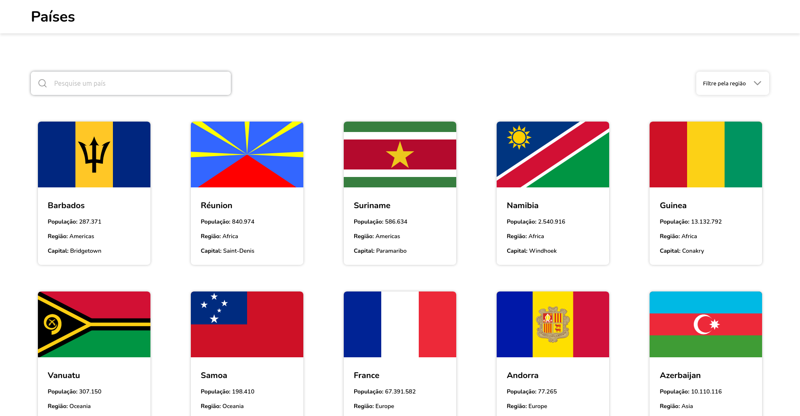
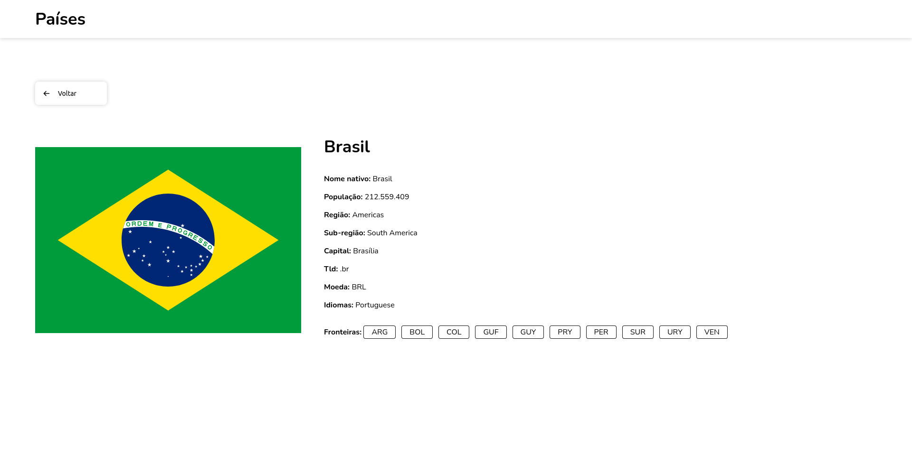

# React Country

A Next.js app with Styled-Components to get information about countries.




## Features

- See all countries on the homepage
- Search for countries by name
- Filter countries by region
- View detailed information about a country, including its flag, capital, population, and more
- Navigation between bordering countries on the details page
- Responsive layout
- Animations

## Technologies

- React
- Next.js
- Styled-Components
- Framer-motion
- Phosphor icons
- Axios
- REST Countries API

## Getting Started

To get a local copy up and running, follow these steps:

1. Clone the repository
2. Install the dependencies:

```bash
# If you are using NPM
npm install

# If you are using Yarn
yarn install

# If you are using PNPM
pnpm install
```

3. Start the development server:

```bash
# If you are using NPM
npm run dev

# If you are using Yarn
yarn dev

# If you are using PNPM
pnpm dev
```
