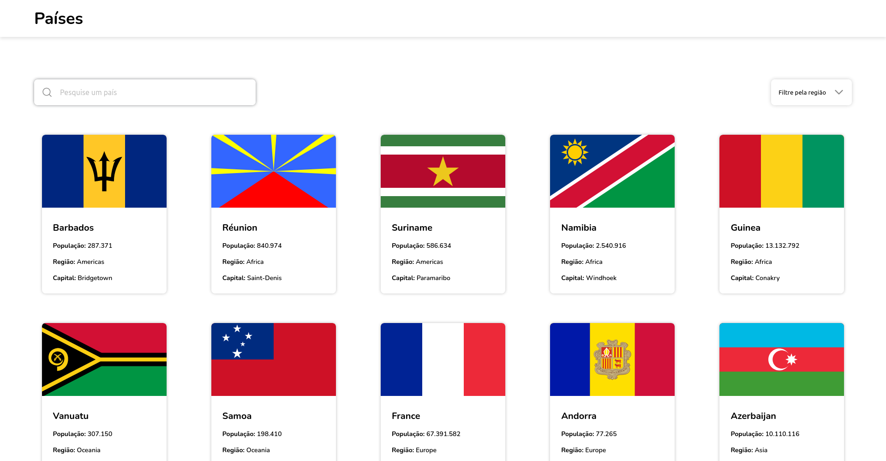
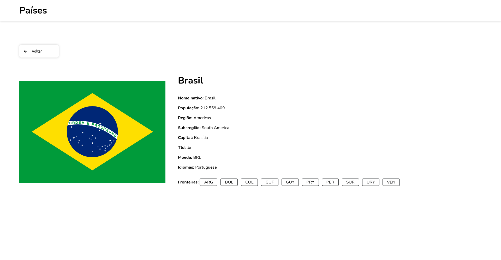

# React Country

Um aplicativo Next.js com Styled-Components para obter informações sobre países.




## Funcionalidades

- Veja todos os países na página inicial
- Pesquise países por nome
- Filtra países por região
- Veja informações detalhadas sobre um país, incluindo sua bandeira, capital, população e mais
- Navegação entre os países fronteiriços na página de detalhes
- Layout responsivo
- Animações

## Tecnologias

- [React](https://react.dev/)
- [Next.js](https://nextjs.org/docs/)
- [Styled-Components](https://styled-components.com/docs)
- [Phosphor icons](https://phosphoricons.com/)
- [Axios](https://axios-http.com/docs/intro)
- [REST Countries API](https://restcountries.com/)

## Boas práticas/Padrões utilizados

- React Hooks (useState, useDeferredValue)
- Custom hooks (useCountry, useFilteredCountries)
- Component Composition Pattern (Padrão de composição de componentes)
- Next.js Rotas Dinâmicas com getStaticProps e getStaticPaths
- Tematização utilizando o ThemeProvider do Styled-Components
- Reidratação da folha de estilo usando o ServerStyleSheet para SSR (Server-side rendering, ou seja, Renderização no lado do servidor) no Next.js com o Styled-Components
- CSS Grid Layout e CSS Flexible Box Layout
- Media queries

## Começando

Para ter uma cópia local em execução, siga estas etapas:

1. Clone o repositório
2. Instale as dependências:

```bash
# Se você está usando NPM
npm install

# Se você está usando Yarn
yarn install

# Se você está usando PNPM
pnpm install
```

3. Inicie o servidor de desenvolvimento:

```bash
# Se você está usando NPM
npm run dev

# Se você está usando Yarn
yarn dev

# Se você está usando PNPM
pnpm dev
```
